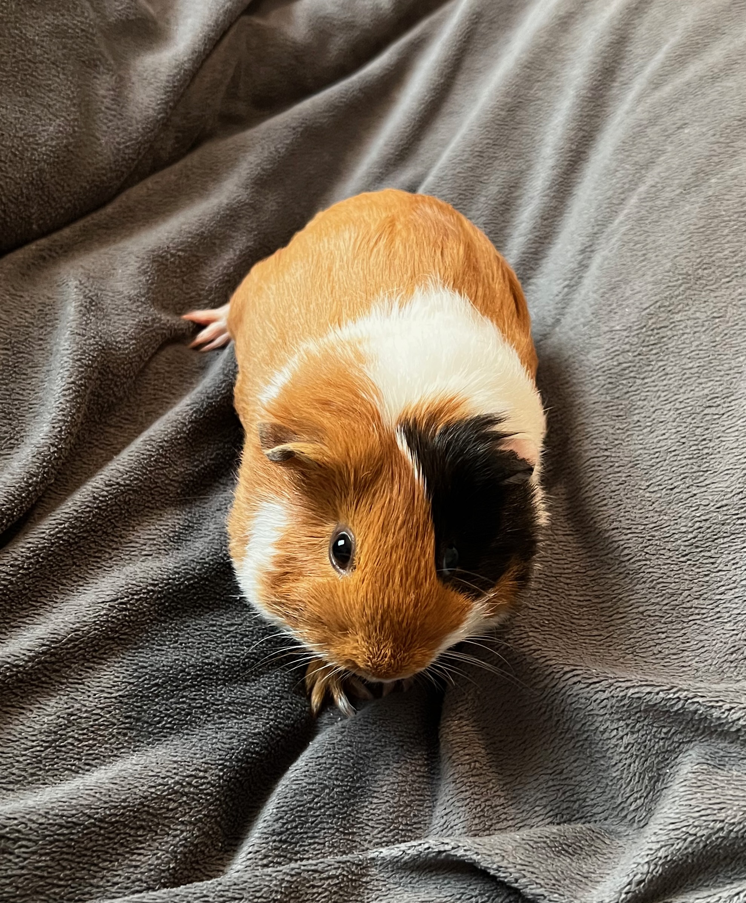
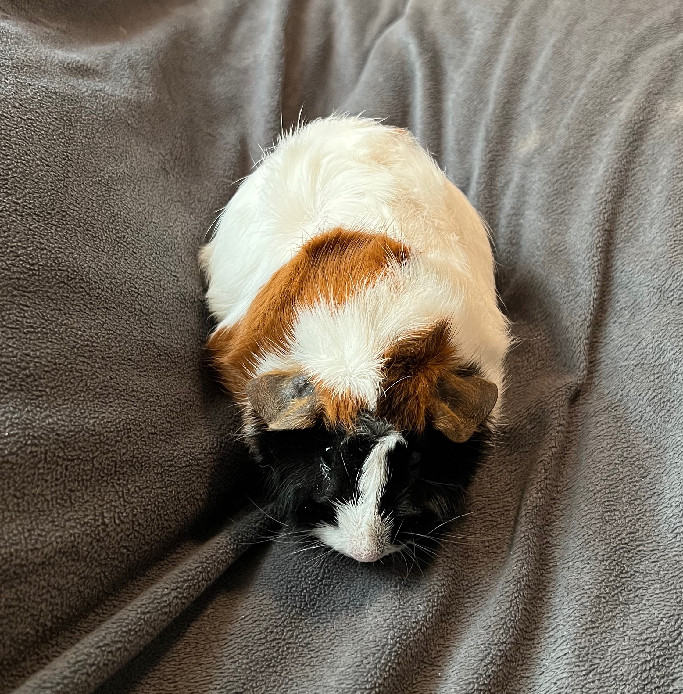

# Pet Growth Tracker

## Purpose
This is currently a project to help me practice using data structures that I am less confident with, as well as track the growth of my new pets. It is a personal project designed to help incorporate programming into aspects of my daily life, while allowing me to practice with some real world information. 

I may expand it to be its own standalone app eventually, but for now it is just a place for me to store some data on my pets and add new refinements as I learn them. 

Also here are Reese and Puff:

